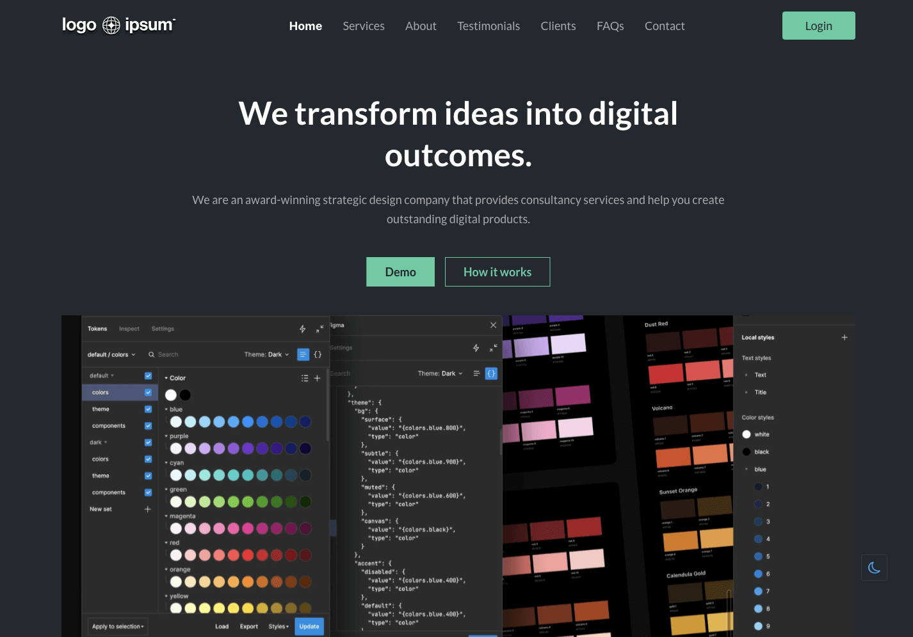

# Overview

[MS-SPA](https://fastn-community.github.io/midnight-storm/) will help
you create a beautiful single page application(SPA) site in no time.

It provides out-of-the-box documentation features that can be used to create your business site with fastn language.

# Preview

## Get Rolling

[Click here](https://fastn-community.github.io/midnight-storm/) to learn how to use this template.

# [Dive into the Docs](https://fastn-community.github.io/midnight-storm/)

# See it in Action!

Explore websites and projects that have utilized this component/template 
**[here](https://fastn-community.github.io/midnight-storm/)** for
inspiration.

## fastn and Curious?

Discover more of fastn here.

- [Expander Crash Course](https://fastn.com/expander/)
- [Video Tutorials](https://fastn.com/expander/hello-world/-/build/)
- [Explore more Templates/ Components/ Package](https://fastn.com/featured/)

## Become a fastn Contributor

1.  Finish the [Expander Crash Course](https://fastn.com/expander/)
2.  Share your progress and ideas on [Discord](https://discord.gg/bucrdvptYd).
3.  Let our team guide you on your contributor journey.

## Become a fastn-trailblazer

- [Join our Discord Server](https://discord.gg/bucrdvptYd) to connect with other fastn enthusiasts and stay up to date with the latest developments.
- [Star us on GitHub](https://github.com/fastn-stack/fastn/)
